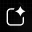

  

  

  

  

    <table width="100%" style="table-layout: fixed;">
        <tr>
            <!-- Row 1: Bio on the left side -->
            <td width="50%" align="left" valign="top">
<h1 align="center">Hi 👋, I'm Harshit</h1>
<h3 align="center">cse student surviving through an existential crisis</h3>
  

    <ul align="left">
      <li>an average cs student trying to stay alive.</li>
      <li>i also do video games, sketching, and photography.</li>
      <li>fun fact **dead ^___^**.</li>
    </ul>
  

            </td>
            <!-- Row 1: Badges on the right side -->
            <td width="50%" align="center" valign="middle">
                <!--  -->
            </td>
        </tr>
        <tr>
            <!-- Spotify embed on the left side -->
            <td width="50%" align="center" valign="middle">
                
            </td>
            <!-- GIF on the right side -->
            <td width="50%" align="center" valign="middle">
                
            </td>
        </tr>
        <tr>
            <td align="left" valign="top" style="white-space: nowrap; width: 35%; padding-right: 14px;">
                <h3 align="left">Programming Languages:</h3>
            </td>
            <td align="left" valign="top" style="width: 65%;">
                        
            </td>
        </tr>
        <tr>
            <td align="left" valign="top" style="white-space: nowrap; width: 35%; padding-right: 14px;">
                <h3 align="left">Hardware & Prototyping:</h3>
            </td>
            <td align="left" valign="top" style="width: 65%;">
                    
            </td>
        </tr>
        <tr>
            <td align="left" valign="top" style="white-space: nowrap; width: 35%; padding-right: 14px;">
                <h3 align="left">Machine Learning & Data Science:</h3>
            </td>
            <td align="left" valign="top" style="width: 65%;">
                         
            </td>
        </tr>
        <tr>
            <td align="left" valign="top" style="white-space: nowrap; width: 35%; padding-right: 14px;">
                <h3 align="left">Web Development Frameworks:</h3>
            </td>
            <td align="left" valign="top" style="width: 65%;">
                   
            </td>
        </tr>
        <tr>
            <td align="left" valign="top" style="white-space: nowrap; width: 35%; padding-right: 14px;">
                <h3 align="left">Databases:</h3>
            </td>
            <td align="left" valign="top" style="width: 65%;">
                       
            </td>
        </tr>
        <tr>
            <td align="left" valign="top" style="white-space: nowrap; width: 35%; padding-right: 14px;">
                <h3 align="left">DevOps & Environments:</h3>
            </td>
            <td align="left" valign="top" style="width: 65%;">
                    
            </td>
        </tr>
        <tr>
            <td align="left" valign="top" style="white-space: nowrap; width: 35%; padding-right: 14px;">
                <h3 align="left">Cloud & Hosting Platforms:</h3>
            </td>
            <td align="left" valign="top" style="width: 65%;">
                        
            </td>
        </tr>
        <tr>
            <td align="left" valign="top" style="white-space: nowrap; width: 35%; padding-right: 14px;">
                <h3 align="left">Testing & APIs:</h3>
            </td>
            <td align="left" valign="top" style="width: 65%;">
                  
            </td>
        </tr>
        <tr>
            <td align="left" valign="top" style="white-space: nowrap; width: 35%; padding-right: 14px;">
                <h3 align="left">Design & Creativity:</h3>
            </td>
            <td align="left" valign="top" style="width: 65%;">
                     
            </td>
        </tr>
        <tr>
            <td align="left" valign="top" style="white-space: nowrap; width: 35%; padding-right: 14px;">
                <h3 align="left">AI & LLMs:</h3>
            </td>
            <td align="left" valign="top" style="width: 65%;">
                         
            </td>
        </tr>
        <tr>
            <td align="left" valign="top" style="white-space: nowrap; width: 35%; padding-right: 14px;">
                <h3 align="left">Configuration & Data Formats:</h3>
            </td>
            <td align="left" valign="top" style="width: 65%;">
                  
            </td>
        </tr>
        <tr>
            <td width="50%" align="center" valign="middle" style="text-align: center; vertical-align: middle;">
                

                    
                

            </td>
            <td width="50%" align="center" valign="middle" style="text-align: center; vertical-align: middle;">
                

                    
                

            </td>
        </tr>
        <tr>
            <td width="50%" align="center" valign="top" style="text-align: center;">
                

                    
                

            </td>
            <td width="50%" align="center" valign="top" style="text-align: center;">
                

                    
                

            </td>
        </tr>
    </table>

 

    

